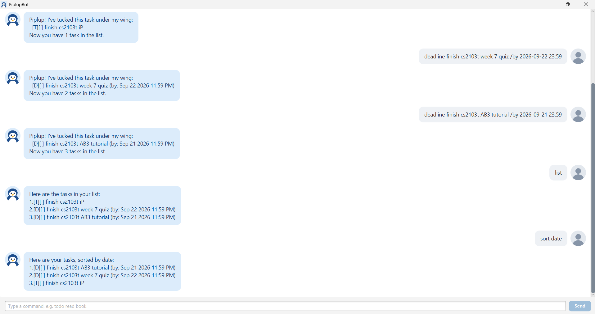

# PiplupBot User Guide



PiplupBot is a cheerful penguin chatbot that keeps track of your todos, deadlines and events. You type short commands to add, find and tick off tasks, and PiplupBot remembers them for you, even after you close it. Piplup!

## Contents

- [Quick start](#quick-start)
- [Command summary](#command-summary)
- [Features](#features)
  - [Adding a todo: `todo`](#adding-a-todo-todo)
  - [Adding a deadline: `deadline`](#adding-a-deadline-deadline)
  - [Adding an event: `event`](#adding-an-event-event)
  - [Writing dates and times](#writing-dates-and-times)
  - [Listing all tasks: `list`](#listing-all-tasks-list)
  - [Marking a task as done: `mark`, `unmark`](#marking-a-task-as-done-mark-unmark)
  - [Deleting a task: `delete`](#deleting-a-task-delete)
  - [Finding tasks: `find`](#finding-tasks-find)
  - [Sorting tasks: `sort`](#sorting-tasks-sort)
  - [Reusing earlier commands: Up and Down keys](#reusing-earlier-commands-up-and-down-keys)
  - [Exiting PiplupBot: `bye`](#exiting-piplupbot-bye)
  - [Saving the data](#saving-the-data)

## Quick start

1. Make sure you have **Java 25** or above installed.<br>
   **Mac users:** install the exact JDK given in [this guide](https://se-education.org/guides/tutorials/javaInstallationMac.html).
2. Download the latest `piplupbot.jar` from the [releases page](https://github.com/PenguinPiplup/ip/releases).
3. Put the file in the folder where you want PiplupBot to keep your tasks.
4. Open a terminal, `cd` into that folder, and run `java -jar piplupbot.jar`.<br>
   A GUI window like the one above opens, and PiplupBot says hello.
5. Type a command in the box at the bottom, then press **Enter** or click **Send**. Some commands to try:

   - `todo buy milk` adds a todo task called "buy milk".
   - `list` shows all your tasks.
   - `mark 1` marks task 1 as done.
   - `delete 1` deletes task 1.
   - `bye` says goodbye and closes PiplupBot.

6. See the [command summary](#command-summary) below for every command at a glance, and [Features](#features) for the details of each command.

> 💡 **Prefer the terminal?** Run `java -jar piplupbot.jar --cli` instead, and chat with PiplupBot right there. The commands are the same.

## Command summary

| Action                    | Format, Examples                                                                                                  |
|---------------------------|-------------------------------------------------------------------------------------------------------------------|
| **Add a 'todo' task**     | `todo DESCRIPTION`<br>e.g. `todo read book`                                                                       |
| **Add a 'deadline' task** | `deadline DESCRIPTION /by DATE`<br>e.g. `deadline return book /by 2026-10-15 1800`                                |
| **Add an 'event' task**   | `event DESCRIPTION /from START /to END`<br>e.g. `event project meeting /from 2026-10-02 1400 /to 2026-10-02 1600` |
| **List** all tasks        | `list`                                                                                                            |
| **Mark / unmark** a task  | `mark TASK_NUMBER`, `unmark TASK_NUMBER`<br>e.g. `mark 2`                                                         |
| **Delete** a task         | `delete TASK_NUMBER`<br>e.g. `delete 3`                                                                           |
| **Find** tasks by keyword | `find KEYWORD`<br>e.g. `find book`                                                                                |
| **Sort** tasks            | `sort KEY [DIRECTION]`<br>Available keys: "date", "name", "type", "done"<br>e.g. `sort date`, `sort name desc`     |
| **Exit** PiplupBot        | `bye`                                                                                                             |

## Features

Under each example is PiplupBot's reply. The examples follow on from each other, starting from an empty task list.

> ℹ️ **Notes about the command format**
>
> - Words in `UPPER_CASE` are for you to fill in. For `todo DESCRIPTION`, you might type `todo read book`.
> - Items in square brackets are optional: `sort KEY [DIRECTION]` can be `sort date` or `sort date desc`.
> - Give the parts in the order shown, with a space before and after `/by`, `/from` and `/to`.
> - Type commands in lower case: `LIST` is not understood.
> - `TASK_NUMBER` is the number that `list` shows beside a task.
> - Made a mistake? PiplupBot tells you what it expected, and your list stays as it was.

### Adding a todo: `todo`

Adds a task with no date.

Format: `todo DESCRIPTION`

Example: `todo read book`

```
Piplup! I've tucked this task under my wing:
  [T][ ] read book
Now you have 1 task in the list.
```

### Adding a deadline: `deadline`

Adds a task that must be done by a certain date and time.

Format: `deadline DESCRIPTION /by DATE`

Example: `deadline return book /by 2026-10-15 1800`

```
Piplup! I've tucked this task under my wing:
  [D][ ] return book (by: Oct 15 2026 06:00 PM)
Now you have 2 tasks in the list.
```

### Adding an event: `event`

Adds a task that starts and ends at given times. The end time must be later than the start time.

Format: `event DESCRIPTION /from START /to END`

Example: `event project meeting /from 2026-10-02 1400 /to 2026-10-02 1600`

```
Piplup! I've tucked this task under my wing:
  [E][ ] project meeting (from: Oct 2 2026 02:00 PM to: Oct 2 2026 04:00 PM)
Now you have 3 tasks in the list.
```

### Writing dates and times

`DATE`, `START` and `END` are a date followed by a 24-hour time (`1800` is 6 PM). Write the date in either of these forms:

- year-month-day, e.g. `2026-10-15 1800`
- day/month/year, e.g. `15/10/2026 1800`

The time may also have a colon, as in `18:00`.

> 💡 **Tip:** You can leave out the time, but PiplupBot then reads it as 12:00 AM, the very *start* of that day. For "by the end of 15 October", type `2026-10-15 2359`.

### Listing all tasks: `list`

Shows all your tasks, numbered from 1.

Format: `list`

```
Here are the tasks in your list:
1.[T][ ] read book
2.[D][ ] return book (by: Oct 15 2026 06:00 PM)
3.[E][ ] project meeting (from: Oct 2 2026 02:00 PM to: Oct 2 2026 04:00 PM)
```

The first box shows the kind of task (`T` todo, `D` deadline, `E` event), and the second box shows `X` once the task is done.

### Marking a task as done: `mark`, `unmark`

`mark` ticks a task off as done, and `unmark` changes it back to not done.

Format: `mark TASK_NUMBER` or `unmark TASK_NUMBER`

Example: `mark 2`

```
Piplup! One more fish in the bucket. I've marked this task as done:
  [D][X] return book (by: Oct 15 2026 06:00 PM)
```

### Deleting a task: `delete`

Removes a task from your list. All tasks after the deleted task move up by one number.

Format: `delete TASK_NUMBER`

Example: `delete 3`

```
Splash! I've washed this task away:
  [E][ ] project meeting (from: Oct 2 2026 02:00 PM to: Oct 2 2026 04:00 PM)
Now you have 2 tasks in the list.
```

> ⚠️ There is no undo option, so check the task number with `list` first.

### Finding tasks: `find`

Shows the tasks whose description contains a word or phrase.

Format: `find KEYWORD`

- Capitals do not matter, and part of a word is enough: `find BOO` finds `read book`.
- Only descriptions are searched, not dates.
- Several words are searched for as one phrase: `find read book` does not find `book to read`.

Example: `find book`

```
Here are the matching tasks in your list:
1.[T][ ] read book
2.[D][X] return book (by: Oct 15 2026 06:00 PM)
```

> ⚠️ These numbers only count the matches. To `mark` or `delete` a task, use its number from `list`.

### Sorting tasks: `sort`

Puts your tasks in order, then shows them.

Format: `sort KEY [DIRECTION]`

| `KEY` | Order |
| --- | --- |
| `date` | Earliest first (an event by its start time). Todos have no date, so they always go last. |
| `name` | A to Z, ignoring capitals |
| `type` | Todos, then deadlines, then events |
| `done` | Unfinished tasks first |

`DIRECTION` is `asc` (the default) or `desc`, which reverses the order.

Example: `sort date`

```
Here are your tasks, sorted by date:
1.[D][X] return book (by: Oct 15 2026 06:00 PM)
2.[T][ ] read book
```

> ⚠️ Your list keeps the new order, so the task numbers change with it: `read book` is now task 2. The old order cannot be brought back.

### Reusing earlier commands: Up and Down keys

In the input box, press the Up arrow key to bring back your previous command. Press it again to go further back, or press Down to retrieve your next command. Edit the command if you like, then press Enter.

### Exiting PiplupBot: `bye`

Says goodbye, then closes PiplupBot.

Format: `bye`

```
Pip-pip! Off for a swim. Hope to see you again soon!
```

### Saving the data

PiplupBot automatically saves your tasks after every change, so there is no need to save by hand, and you can close the window at any time. Your tasks are kept in `data/piplupbot.txt`, inside the folder you started PiplupBot from.

> 💡 **Moving to another computer?** Copy the `data` folder into the folder you run PiplupBot from there.
> 